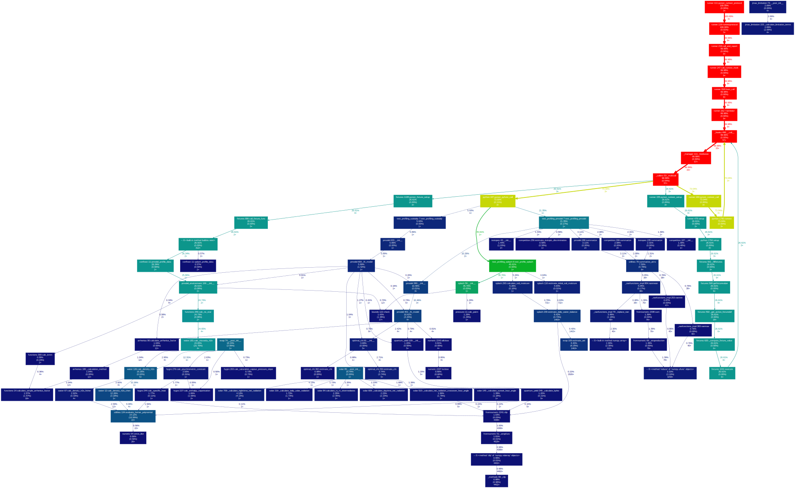

---
jupytext:
  formats: md:myst
  text_representation:
    extension: .md
    format_name: myst
    format_version: 0.13
    jupytext_version: 1.16.2
kernelspec:
  display_name: Python 3
  language: python
  name: python3
---

# Profiling and benchmarking

We use code profiling to assess the performance of `pyrealm` code and compare it to
previous code versions to identify bottlenecks and guard against degraded performance
when code changes.

Profiling and benchmarking can be run manually - which is useful if you are working on
code and want to check it doesn't impact performance - but are also run as part of the
continuous integration process when code is to be merged into the `develop` or `main`
branches.

## Latest performance results

The two plots below show the current profiling and benchmarking results. The
**profiling plot** shows where time is spent in the different calls during the profiling
tests on the codebase at a single commit.



The **benchmarking** plot shows the cumulative time per call for successive commits and
allows developers to check if an incoming commit has caused code to slow down more than
a given threshold (currently 5% longer run times or greater).


## Running code profiling

We use the [pytest-profiling](https://pypi.org/project/pytest-profiling/) plugin to run
a set of profiling tests and generate profiling data. These tests are located in
`tests/profiling` and consist of a small set of high-level scripts that are intended to
use a large proportion of the `pyrealm` codebase with reasonably large inputs.

All tests in the profiling suite are decorated with `@pytest.mark.profiling`. Tests with
this mark are excluded from the standard `pytest` testing via the `-m "not profiling"`
argument in `setup.cfg`. Any test can be decorated with the `profiling` mark to move it
temporarily into the profiling test suite.

To run the profiling test suite and generate code profiling data, run `pytest` as
follows:

```bash
poetry run pytest --profile-svg -m "profiling"
```

This selects _only_ the profiling tests and runs them using `pytest-profiling`. The
`--profile-svg` both runs the profiling _and_ generates a figure showing the call
hierachy of code objects and the time spent in each call. Generating this graph requires
the [graphviz](https://pypi.org/project/graphviz/) command line library, which provides
the `dot` command for generating SVG graph diagrams. You will need to install `graphviz`
to use this option. Alternatively, you can use the following command to only generate
the profile data.

```bash
poetry run pytest --profile -m "profiling"
```

The `pytest-profiling` plugin saves data and graphs to the `prof` directory, which is
excluded from the `git` repository. The key files are the combined results:
`prof/combined.prof` and `prof/combined.svg`.

### Scaling of the profiling with problem size

The profiling tests use a couple of smaller datasets that are then tiled to scale up the
problem size. The size of these scaling factors can be controlled from the command line.

* This scaling up is partly to get more stable profiling results -  small problems have
  a lot of runtime noise, leading to benchmarking fails.
* Having variable dataset size also allows profiling to look at how the code performance
  scales.
* The scaling up also affects the peak memory usage of the tests, which can lead to
  issues with running the tests on local machines and GitHub Action runners.

The data below shows how the peak memory usage changes with problem set scaling factors.
The peak memory size is estimated using, `/usr/bin/time -l` and changing the scaling
factors (note that `-v` is required instead on Linux systems). For example:

```sh
/usr/bin/time -l pytest tests/profiling/test_profiling_pmodel.py \
    -m "profiling" --pmodel-profile-scaleup 10
```

<!-- markdownlint-disable MD004 -->

:::{list-table} test_profiling_pmodel.py
:header-rows: 1

* - pmodel_profile_scaleup
  - peak memory footprint in GB
* - 40
  - 35.84
* - 20
  - 19.74
* - 10
  - 9.95
:::

:::{list-table} test_profiling_splash.py
:header-rows: 1

* - splash_profile_scaleup
  - peak memory footprint in GB
* - 500
  - 22.47
* - 250
  - 11.54
* - 125
  - 5.95
:::

<!-- markdownlint-enable MD004 -->

The peak memory usage of the full profiling suite is currently around 11GB with the
defaults of  `--splash-profile-scaleup 125` and `--pmodel-profile-scaleup 6`.

## Benchmarking code performance

When `pytest-profiling` runs, the resulting `prof/combined.prof` file contains detailed
information on all the calls invoked in the test code, including the number of times
each call is made and the time spent on each call. The `prof/combined.svg` shows where
time is spent during the test runs, which identifies bottlenecks, but it is also useful
to check that the time spent on a call has not increased markedly when code is revised.

The `profiling` directory contains a database of previous profiling results
(`profiling-database.csv`) and the `run_benchmarking.py` tool, which can be used to
benchmark new profiling data. The basic process is:

* read the current `prof/combined.prof` file and convert it to human-readable CSV data,
* find the best performance for each call over recent previous runs, and
* check if the relative performance of the incoming code is notably slower than that
  best performance.

By default, we use the 5 most recent code versions and the threshold performance is 5%
slower than the previous best performance. The report tool consists of a command line
wrapper around a set of profiling functions, which can be imported for programatic use.
for use.

The usage of the tool is:

```text
usage: run_benchmarking.py [-h] [--exclude EXCLUDE] [--n-runs N_RUNS]
                           [--tolerance TOLERANCE] [--append-on-pass] [--new-database]
                           [--plot-path PLOT_PATH]
                           prof_path database_path fail_data_path label

Run the package benchmarking.

This function runs the standard benchmarking for the pyrealm package. The profiling
tests in the test suite generate a set of combined profile data across the package
functionality. This command then reads in a set of combined profile data and
compares it to previous benchmark data.

The profiling excludes all profiled code objects matching regex patterns provided
using the `--exclude` argument. The defaults exclude standard and site packages,
built in code and various other standard code, and are intended to reduce the
benchmarking to only code objects within the package.

positional arguments:
  prof_path              Path to pytest-profiling output
  database_path          Path to benchmarking database
  fail_data_path         Output path for data on benchmark fails
  label                  A text label for the incoming profiling results, typically a
                         commit SHA

options:
  -h, --help             show this help message and exit
  --exclude EXCLUDE      Exclude profiled code matching a regex pattern, can be repeated
                         (default: ['{.*}', '<.*>', '/lib/'])
  --n-runs N_RUNS        Number of most recent runs to use in benchmarking (default: 5)
  --tolerance TOLERANCE  Tolerance of time cost increase in benchmarking (default: 0.05)
  --append-on-pass       Add incoming data to the database when benchmarking passes
                         (default: False)
  --new-database         Use the incoming data to start a new profiling database
                         (default: False)
  --plot-path PLOT_PATH  Generate a benchmarking plot to this path (default: None)
```

### Manual benchmarking

Once you have run the `pytest-profiling` test suite and generated `prof/combined.prof`
for some new code, you can run the following code to benchmark those results. In the
code below, `incoming` is used as a label for the new code, but it is more useful to use
the commit SHA to identify the profiled code more explicitly. The SHA is a unique hash
calculated from summary information for each commit. The SHA is 40 characters long (e.g.
`4413a1954447497ee8a236eb447520646437519f`), but is usually truncated to the first 7
characters (`4413a19`): this can be shown for the last commit using
`git rev-parse --short HEAD`.

```bash
poetry run python profiling/run_benchmarking.py \
       prof/combined.prof profiling/profiling-database.csv \
       profiling/benchmark-fails.csv incoming
```

This command will run the benchmark checks and print a success or failure message to the
screen. If the benchmarking fails, then the file `benchmark-fails.csv` will be created
and will contain the incoming and database performance data for all processes that have
failed benchmarks. You can alter the benchmark tolerance and number of most recent
versions used for comparison, and also generate a plot of relative performance.

```bash
poetry run python profiling/run_benchmarking.py \
       prof/combined.prof profiling/profiling-database.csv \
       profiling/benchmark-fails.csv incoming \
       --n-runs 4 --tolerance 0.06 \
       --plot-path profiling/performance-plot.png
```

If benchmarking passes, the incoming data _can_ be added to the main
`profiling-database.csv` database using the `--update-on-pass` option, but this database
should generally **only be updated by the continuous integration process** . If you do
want to compare profiles for multiple local versions of code, you can provide a new path
and this will be used to create a separate local database. The `--update-on-pass` option
can then be used to add data to that local file for testing purposes.

```bash
poetry run python profiling/run_benchmarking.py \
       prof/combined.prof profiling/local-database.csv \
       profiling/benchmark-fails.csv incoming
```

### Continuous integration benchmarking

The continuous integration process runs the profiling test suite and then runs the
benchmarking with the following settings, where `8c2cbfe` is the commit SHA of the code
being profiled and using the default number of previous runs (5) and tolerance (0.05):

```bash
poetry run python profiling/run_benchmarking.py \
       prof/combined.prof profiling/profiling-database.csv \
       profiling/benchmark-fails.csv 8c2cbfe \
       --plot-path profiling/performance-plot.png --update-on-pass
```

The continuous integration process automatically commits the results of benchmarking
into the repository. If the benchmarking **passes**, these commits will be:

* an update to `profiling/profiling-database.csv` to add the new performance data,
* a new version of `profiling/performance-plot.png`, and
* a copy of the call graph generated by profiling (`prof/combined.svg` is copied to
  `profiling/call-graph.svg`)

If the benchmarking **fails**, two files are updated to identify the processes
responsible for the failure:

* a new version of `profiling/performance-plot.png` to help see what has failed.
* an update to `profiling/benchmark-fails.csv`, which gives data on the failed process
  and recent versions it has been compared to.

### Resolving failed benchmarking

If benchmarking fails then the incoming code has introduced possibly troublesome
performance issues. If the code can be made more efficient, then submit commits to fix
the performance, which will re-run the CI process and benchmarking.

However, if the code cannot be made more efficient, or does something new that is
inherently more time-consuming, then the `profiling-database.csv` can be updated to
exclude performance targets that are now expected to fail. Find the rows in the database
for the most recent 5 versions for the failing code and change the `ignore_result` field
to `True` if that row sets an unachievable target for the new code. You should also
provide a brief comment in the `ignore_justification` field to explain which commit is
being passed as a result and why.
