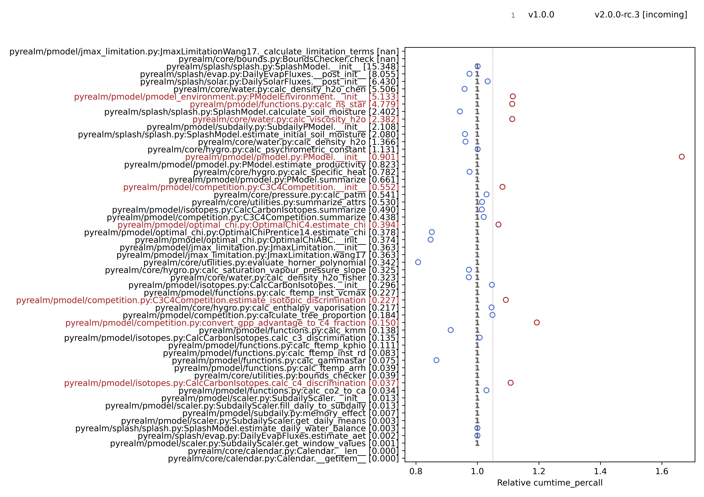

---
jupytext:
  formats: md:myst
  text_representation:
    extension: .md
    format_name: myst
    format_version: 0.13
kernelspec:
  display_name: Python 3
  language: python
  name: python3
language_info:
  codemirror_mode:
    name: ipython
    version: 3
  file_extension: .py
  mimetype: text/x-python
  name: python
  nbconvert_exporter: python
  pygments_lexer: ipython3
  version: 3.11.9
---

# Profiling and benchmarking

We use code profiling to assess the performance of `pyrealm` code and compare it to
previous code versions to identify bottlenecks and guard against degraded performance
when code changes.

Profiling and benchmarking can be run manually when you have made changes to the code
and want to check it doesn't impact performance. The tools listed below can highlight
where there may be issues in the code which should be fixed prior to integration by a
pull request.

## Latest performance results

The two plots below show the current profiling and benchmarking results. The
**profiling plot** shows where time is spent in the different calls during the profiling
tests on the codebase at a single commit.


The **benchmarking** plot shows the cumulative time per call for successive commits and
allows developers to check if an incoming commit has caused code to slow down more than
a given threshold (currently 5% longer run times or greater).



## Running code profiling

We use the [pytest-profiling](https://pypi.org/project/pytest-profiling/) plugin to run
a set of profiling tests and generate profiling data. These tests are located in
`tests/profiling` and consist of a small set of high-level scripts that are intended to
use a large proportion of the `pyrealm` codebase with reasonably large inputs.

All tests in the profiling suite are decorated with `@pytest.mark.profiling`. Tests with
this mark are excluded from the standard `pytest` testing via the `-m "not profiling"`
argument in `setup.cfg`. Any test can be decorated with the `profiling` mark to move it
temporarily into the profiling test suite.

To run the profiling test suite and generate code profiling data, run `pytest` as
follows:

```bash
poetry run pytest --profile-svg -m "profiling"
```

This selects _only_ the profiling tests and runs them using `pytest-profiling`. The
`--profile-svg` both runs the profiling _and_ generates a figure showing the call
hierachy of code objects and the time spent in each call. Generating this graph requires
the [graphviz](https://pypi.org/project/graphviz/) command line library, which provides
the `dot` command for generating SVG graph diagrams. You will need to install `graphviz`
to use this option. Alternatively, you can use the following command to only generate
the profile data.

```bash
poetry run pytest --profile -m "profiling"
```

The `pytest-profiling` plugin saves data and graphs to the `prof` directory, which is
excluded from the `git` repository. The key files are the combined results:
`prof/combined.prof` and `prof/combined.svg`.

### Scaling of the profiling with problem size

The profiling tests use a couple of smaller datasets that are then tiled to scale up the
problem size. The size of these scaling factors can be controlled from the command line.

* This scaling up is partly to get more stable profiling results -  small problems have
  a lot of runtime noise, leading to benchmarking fails.
* Having variable dataset size also allows profiling to look at how the code performance
  scales.
* The scaling up also affects the peak memory usage of the tests, which can lead to
  issues with running the tests on local machines and GitHub Action runners.

The data below shows how the peak memory usage changes with problem set scaling factors.
The peak memory size is estimated using, `/usr/bin/time -l` and changing the scaling
factors (note that `-v` is required instead on Linux systems). For example:

```sh
/usr/bin/time -l pytest tests/profiling/test_profiling_pmodel.py \
    -m "profiling" --pmodel-profile-scaleup 10
```

<!-- markdownlint-disable MD004 -->

:::{list-table} test_profiling_pmodel.py
:header-rows: 1

* - pmodel_profile_scaleup
  - peak memory footprint in GB
* - 40
  - 35.84
* - 20
  - 19.74
* - 10
  - 9.95
:::

:::{list-table} test_profiling_splash.py
:header-rows: 1

* - splash_profile_scaleup
  - peak memory footprint in GB
* - 500
  - 22.47
* - 250
  - 11.54
* - 125
  - 5.95
:::

<!-- markdownlint-enable MD004 -->

The peak memory usage of the full profiling suite is currently around 11GB with the
defaults of  `--splash-profile-scaleup 125` and `--pmodel-profile-scaleup 6`.

## Benchmarking code performance

### Simple benchmarking

The `profiling` directory contains a tool for performing simple regression testing,
`performance_regression_checking.sh`. This can identify if changes have affected the
speed of the code by comparing the overall time taken to run the profiling test
functions.

The script can be run without arguments to compare the current `HEAD` with the
`origin/develop` branch. Alternatively, command line arguments can be used to compare
any two commits:

```bash
./performance_regression_checking -n [NEW-COMMIT] -o [OLD-COMMIT]
```

### Advanced benchmarking

When `pytest-profiling` runs, the resulting `prof/combined.prof` file contains detailed
information on all the calls invoked in the test code, including the number of times
each call is made and the time spent on each call. The `prof/combined.svg` shows where
time is spent during the test runs, which identifies bottlenecks, but it is also useful
to check that the time spent on each function call has not increased markedly when code
is revised.

To do this, the `profiling` directory also contains the `run_benchmarking.py` tool. This
will check if any function is more than a certain tolerance (5% by default) slower than
a previous run.

The usage of the tool is:

```text
usage: run_benchmarking.py [-h] [--exclude EXCLUDE] [--n-runs N_RUNS]
                           [--tolerance TOLERANCE] [--update-on-pass]
                           [--plot-path PLOT_PATH]
                           prof_path database_path fail_data_path label

Run the package benchmarking.

This function runs the standard benchmarking for the pyrealm package. The profiling
tests in the test suite generate a set of combined profile data across the package
functionality. This command then reads in a set of combined profile data and
compares it to previous benchmark data.

The profiling excludes all profiled code objects matching regex patterns provided
using the `--exclude` argument. The defaults exclude standard and site packages,
built in code and various other standard code, and are intended to reduce the
benchmarking to only code objects within the package.

positional arguments:
  prof_path              Path to pytest-profiling output
  database_path          Path to benchmarking database
  fail_data_path         Output path for data on benchmark fails
  label                  A text label for the incoming profiling results, typically a
                         commit SHA

options:
  -h, --help             show this help message and exit
  --exclude EXCLUDE      Exclude profiled code matching a regex pattern, can be repeated
                         (default: ['{.*}', '<.*>', '/lib/'])
  --n-runs N_RUNS        Number of most recent runs to use in benchmarking (default: 5)
  --tolerance TOLERANCE  Tolerance of time cost increase in benchmarking (default: 0.05)
  --update-on-pass       Update the profiling database if benchmarking passes (default:
                         False)
  --plot-path PLOT_PATH  Generate a benchmarking plot to this path (default: None)
```

To perform the comparison it is necessary to first generate a performance database for
at least one previous version. This is likely to be `origin/develop` for incorporating
changes. The workflow is therefore:

* Checkout the previous commit to be used for comparison: `git checkout origin/develop`

* Perform the profiling: `poetry run pytest --profile -m "profiling"`

* Run `run_benchmarking.py` to generate the performance database,
  `profiling/profiling-database.csv` (Remove it first if it already exists).

  ```bash
  poetry run python profiling/run_benchmarking.py \
         prof/combined.prof profiling/profiling-database.csv \
         profiling/benchmark-fails.csv PREVIOUS
  ```

* Return to the commit to be benchmarked: `git checkout -`

* Perform the profiling: `poetry run pytest --profile -m "profiling"`

* Re-run `run_benchmarking.py` to benchmark the new code.

  ```bash
  poetry run python profiling/run_benchmarking.py \
         prof/combined.prof profiling/profiling-database.csv \
         profiling/benchmark-fails.csv INCOMING \
         --plot-path profiling/performance-plot.png
  ```

* Check the results to see if the relative performance of the incoming code is notably
  slower than the previous performance.

The second call to `run_benchmarking.py` will run the benchmark checks and print a
success or failure message to the screen depending upon if any functions have increased
by more than the tolerance.  It will also create `performance-plot.png` which shows how
the relative performance of each function has changed, and highlights any functions
which have slowed down by more than the tolerance.  If the benchmarking fails, then the
file `benchmark-fails.csv` is created, containing the incoming and database performance
data for all processes that have failed benchmarks.

In the above code `PREVIOUS` and `INCOMING` are used as labels for the old and new
code, respectively. But it can be more useful to use the commit SHA to identify the
profiled code more explicitly. The SHA is a unique hash calculated from summary
information for each commit. The SHA is 40 characters long, but is usually truncated to
the first 7 characters. This can be shown for the last commit using `git rev-parse
--short HEAD`.

### Resolving failed benchmarking

If benchmarking fails then the incoming code has introduced possibly troublesome
performance issues. If the code can be made more efficient, then submit commits to fix
the performance and re-run the benchmarking.

## Updating performance results

The results shown [above](#latest-performance-results) can be updated by:

* Copying the call graph generated by profiling (`prof/combined.svg`) to
  `profiling/call-graph.svg`

* Committing the new version of `profiling/performance-plot.png` to show what has
  changed.
