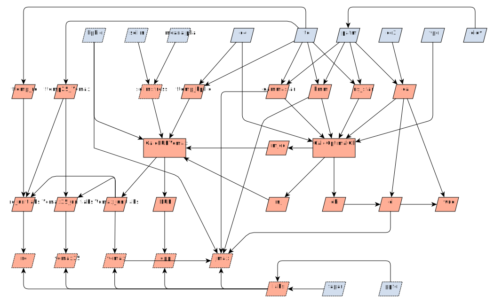

---
jupytext:
  formats: md:myst
  text_representation:
    extension: .md
    format_name: myst
    format_version: 0.13
    jupytext_version: 1.13.8
kernelspec:
  display_name: Python 3
  language: python
  name: pyrealm_python3
---

<!-- markdownlint-disable-next-line MD041 -->
(pmodel_overview)=

# P Model overview

This page provides an overview of the P Model {cite:p}`Prentice:2014bc,Wang:2017go`
along with links to further details of the theory and the code implementation. The
details of calculations and the API for the package code are shown in the [module
reference documentation](../../api/pmodel_api) and a separate page shows [worked
examples](worked_examples) of using `pyrealm` to fitting the P Model.

The P Model is a model of carbon capture and water use by plants. Four forcing variables
are used to define the environment that the plant experiences:

* temperature (`tc`, °C),
* vapor pressure deficit (`vpd`, Pa),
* atmospheric $\ce{CO2}$ concentration (`co2`, ppm), and
* atmospheric pressure (`patm`, Pa).

From these inputs, the model breaks down into four broad stages, each of which is
described in more detail in the link for each stage

The main steps are:

* Calculation of the [photosynthetic environment](photosynthetic_environment). The
  environmental variables are used to calculate four key variables describing the
  photosynthetic environment of a plant.

* Calculation of [leaf $\ce{CO2}$ variables](optimal_chi). The photosynthetic
  environment is then used to calculate the optimal ratio of internal to external CO2
  concentration ($chi$), along with $\ce{CO2}$ partial pressures and limitation factors.
  This step also governs the main differences between C3 and C4 photosynthesis.

* Constraints on [light use efficiency (LUE)](lue_limitation). The calculation of light
  use efficiency can be subjected to a number of constraints:
  
  * Theoretical limitations to the maximum rates of Rubsico regeneration
    ($J_{max}$) and maximum carboxylation capacity ($V_{cmax}$)

  * Temperature sensitivity of the quantum yield efficiency of photosynthesis
  (`kphio`, $\phi_0$).

  * Different approaches to incorporating effects of [soil moisture
    stress](soil_moisture) on productivity.

* Estimation of [gross primary productivity](estimating-productivity). Once LUE has been
  calculated, estimates of absorbed photosynthetically active radiation, can be used to
  predict gross primary productivity (GPP) and other key rates within the leaf.

## Variable graph

The graph below shows these broad model areas in terms of model inputs (blue) and
modelled outputs (red) used in the P-model. Optional inputs and internal variables are
shown with a dashed edge.

## Worked code examples

Two examples of how to use the `pyrealm` package to fit the P Model can be seen in
the [worked examples](worked_examples) page.

These examples also show how the package can be used with array data. The `pyrealm`
package uses the `numpy` package and expects arrays of data to be be passed to all
inputs. Input arrays can be a single scalar value, but all non-scalar inputs must be
**arrays with the same shape**: the `pyrealm` packages does not attempt to resolve the
broadcasting of array dimensions.
