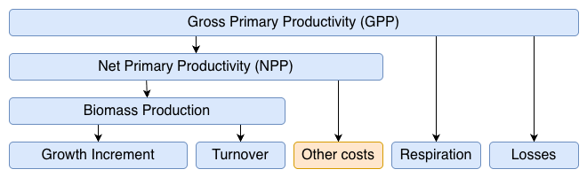

---
jupytext:
  formats: md:myst
  text_representation:
    extension: .md
    format_name: myst
    format_version: 0.13
kernelspec:
  display_name: Python 3 (ipykernel)
  language: python
  name: python3
language_info:
  name: python
  version: 3.14.3
  mimetype: text/x-python
  codemirror_mode:
    name: ipython
    version: 3
  pygments_lexer: ipython3
  nbconvert_exporter: python
  file_extension: .py
---

# The T Model module

```{admonition} Run this notebook
:class: hint

* Read the guide on setting up your computer to [run Jupyter
  notebooks](../getting_started.md)
* Download {nb-download}`this notebook<./carbon_allocation.ipynb>` as a Jupyter notebook.

```

```{code-cell} ipython3
import warnings

from matplotlib import pyplot as plt
import numpy as np
import pandas as pd

from pyrealm.core.experimental import ExperimentalFeatureWarning
from pyrealm.demography.flora import Flora
from pyrealm.demography.cohorts import create_cohorts, cohort_id_generator
from pyrealm.demography.tmodel import (
    StemAllocation,
    StemAllometry,
    GrowthIncrements,
    calculate_whole_crown_gpp,
)

warnings.filterwarnings(
    "ignore",
    category=ExperimentalFeatureWarning,
)
```

The T Model also predicts how gross primary productivity (GPP) will be allocated to
respiration, turnover and growth for stems with a given PFT and allometry using the
{meth}`~pyrealm.demography.tmodel.StemAllometry` class. We first need a set of cohorts
and their stem allometry:

```{code-cell} ipython3
# Create a flora with 3 PFTs with different maximum heights
flora = Flora(name=["short", "medium", "tall"], h_max=[10, 20, 30])

# Create an id generator.
cid_generator = cohort_id_generator(mode="str")

# Create the cohorts
cohorts = create_cohorts(
    flora=flora,
    cid_generator=cid_generator,
    pft_name=np.array(["short", "medium", "tall"]),
    dbh_value=np.array([0.1, 0.1, 0.1]),
    n_individuals=np.array([1, 1, 1]),
)

allometry = StemAllometry(cohorts=cohorts)
```

## Carbon Allocation

This requires an estimate of the GPP available to a stem. The original implementation of
the T Model implemented this (Equation 12, {cite:alp}`Li:2014bc`) using an estimate of
the potential GPP per square metre ($P_0$), scaled up to the crown area of the stem
($A_c$) and using the Beer-Lambert equation to estimate the proportion of potential GPP
captured by the crown as a function of the canopy light extinction coefficient ($k$) and
the canopy {term}`leaf area index<LAI>` ($L$):

$$
\textrm{GPP} =  P_0 A_c (1 - e^{-kL})
$$

This is implemented in the function `calculate_whole_crown_gpp`:

```{code-cell} ipython3
whole_crown_gpp = calculate_whole_crown_gpp(
    potential_gpp=np.array([55]),
    crown_area=allometry.crown_area,
    par_ext=cohorts.par_ext,
    lai=cohorts.lai,
)
print(whole_crown_gpp)
```

Those realised stem GPP values can then be provided to the `StemAllocation` class:

```{code-cell} ipython3
allocation = StemAllocation(
    cohorts=cohorts,
    allometry=allometry,
    whole_crown_gpp=whole_crown_gpp.to_numpy(),
)
allocation
```

The {meth}`~pyrealm.demography.core.ToDataFrameMixin.to_dataframe()` method can be
used to export data for exploration.

```{code-cell} ipython3
allocation.to_dataframe().transpose()
```

The allocation values shown above can then be used to calculate growth increments, as
described in the [T Model overview](./t_model.md):



Under the original T Model, all of the NPP is allocated to biomass production and the
`GrowthIncrements` class can be used to calculate the growth increments after accounting
for turnover. The original implementation of the T Model did not include branch turnover
and the default PFT parameterisation sets branch turnover to zero.

```{code-cell} ipython3
growth = GrowthIncrements(
    cohorts=cohorts, allometry=allometry, stem_allocation=allocation
)
growth
```

```{code-cell} ipython3
growth.to_dataframe().transpose()
```

If you want to incorporate other costs into NPP - decreasing carbon available for
biomass production - the `GrowthIncrements` class has an optional `biomass_production`
argument:

```{code-cell} ipython3
# Reduce estimated NPP by 10% to allocate carbon to other costs
biomass_production = allocation.npp * 0.9
reduced_growth = GrowthIncrements(
    cohorts=cohorts,
    allometry=allometry,
    stem_allocation=allocation,
    biomass_production=biomass_production,
)
reduced_growth.to_dataframe().transpose()
```

### Allocation profiles

As with the `StemAllometry`, the `StemAllocation` class can be used to generate a
profile of the allocation predictions for different estimates of potential GPP. The
`profile=True` option is used to indicate that - instead of providing a single GPP
estimate for each cohort - you want predictions at each GPP estimate for each cohort.

```{code-cell} ipython3
# Calculate the stem GPP from potential GPP following the Li et al model
whole_crown_gpp_profile = np.arange(30, 100)

# Calculate the T Model allocation of those GPP values
allocation_profile = StemAllocation(
    cohorts=cohorts,
    allometry=allometry,
    whole_crown_gpp=whole_crown_gpp_profile,
    profile=True,
)
allocation_profile
```

```{code-cell} ipython3
fig, axes = plt.subplots(ncols=2, nrows=3, sharex=True, figsize=(10, 12))

plot_details = [
    ("sapwood_respiration", "sapwood_respiration"),
    ("foliage_respiration", "foliage_respiration"),
    ("fine_root_respiration", "fine_root_respiration"),
    ("npp", "npp"),
    ("foliage_turnover", "foliage_turnover"),
    ("fine_root_turnover", "fine_root_turnover"),
]

axes = axes.flatten()

for ax, (var, ylab) in zip(axes, plot_details):
    ax.plot(whole_crown_gpp_profile, getattr(allocation_profile, var), label=flora.name)
    ax.set_xlabel("GPP (m)")
    ax.set_ylabel(ylab)

    if var == "whole_crown_gpp":
        ax.legend(frameon=False)
```

Again, with GPP profiles, the
{meth}`~pyrealm.demography.core.ToDataFrameMixin.to_dataframe()` method stacks
predictions into columns identified by pairings of cohort ID and DBH.

```{code-cell} ipython3
allocation_profile.to_dataframe().head(6)[["cohort_id", "whole_crown_gpp", "npp"]]
```
