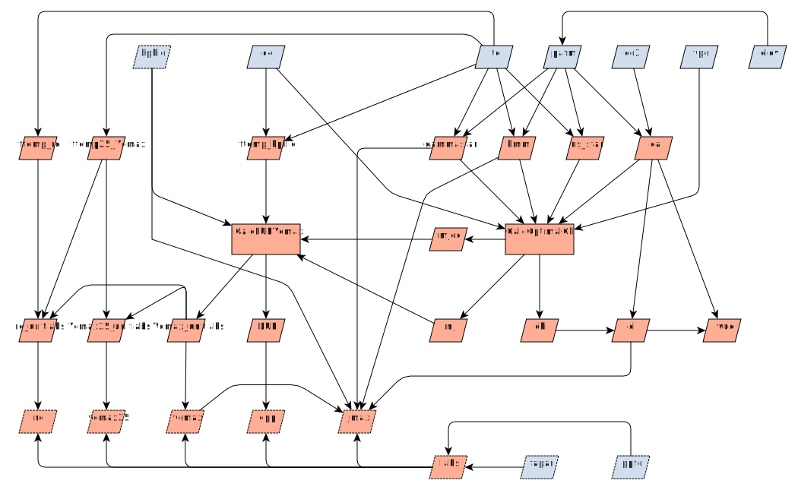

---
jupytext:
  formats: md:myst
  text_representation:
    extension: .md
    format_name: myst
    format_version: 0.13
kernelspec:
  display_name: Python 3 (ipykernel)
  language: python
  name: python3
---

<!-- markdownlint-disable-next-line MD041 -->
(pmodel_overview)=

# The P Model

This page provides an overview of the P Model {cite:p}`Prentice:2014bc,Wang:2017go`
along with links to further details of the theory and the code implementation. See also:

* The details of calculations and the API for the package code are shown in the [module
reference documentation](../../../api/pmodel_api)
* The [worked examples](worked_examples) of using `pyrealm` to fitting the P Model.

## Overview

The P Model is a model of carbon capture and water use by plants. There are four core
forcing variables that define the photosynthetic environment of the plant, although
extensions of the basic P model may add other required variables such as aridity or soil
moisture content. The four core variables are:

* temperature (`tc`, °C),
* vapor pressure deficit (`vpd`, Pa),
* atmospheric $\ce{CO2}$ concentration (`co2`, ppm), and
* atmospheric pressure (`patm`, Pa).

Those forcing variables are then used to calculate four further variables that capture
the [photosynthetic environment](photosynthetic_environment) of a leaf. These are the:

1. photorespiratory compensation point ($\Gamma^*$),
2. Michaelis-Menten coefficient for photosynthesis ($K_{mm}$),
3. relative viscosity of water, given a standard at 25°C ($\eta^*$), and
4. partial pressure of $\ce{CO2}$ in ambient air ($c_a$).

A P Model can then be fitted to calculate the expected optimal light use efficiency
given the environment. The basic calculation captures how many moles of carbon can be
captured for each mole of photosynthetically active photons captured by the leaf. In its
simplest form, this equation is:

$$
  \text{LUE} = M_C \cdot \phi_0 \cdot m_j,
$$

where $M_C$ is the molar mass of carbon and $\phi_0$ (the quantum yield efficiency of
photosynthesis) captures how many moles of photons are required to capture one mole of
carbon dioxide.

The term $m_j$ is at the heart of the P model and describes the trade off between
[carbon dioxide capture and water loss in photosynthesis](optimal_chi). Given the
environmental conditions, a leaf will adjust its stomata, setting a ratio of internal to
external carbon dioxide partial pressure ($\chi$) that optimises this trade off. Under
adverse conditions, this limits the partial pressure of carbon dioxide within the leaf
($c_i = c_a \chi$) and gives rise to the limitation term $m_j$ that describes the
resulting loss in light use efficiency. This calculation also allows the P model to
estimate the intrinsic water use efficiency of photosynthesis (IWUE) as micromoles per
mole of photons.

There are several methods for the calculation of $\chi$ and $m_j$, which are selected
using the `method_optchi` argument when fitting a P model. These methods specify the
choice of C3 and C4 photosynthetic pathways but also environmental modification of
optimal $\chi$.

The P model can optionally include further limitations to the light use efficiency of
photosynthesis. The extended equation shows two modifications:

$$
  \text{LUE} = M_C \cdot \phi_0(E) \cdot  m_j \cdot f_J
$$

* The function $\phi_0(E)$ captures methods that introduce environmental modulation of
  the [quantum yield efficiency of photosynthesis](quantum_yield), such as variation in
  $\phi_0$ with air temperature. These methods are selected using the `method_kphio`
  argument when fitting a P model.

* The additional term $f_j$ describes further [limitation of the electron transfer
  rate](jmax_limitation) of photosynthesis ($J_{max}$ limitation). These methods are
  selected using the `method_jmaxlim` argument when fitting a P model.

:::{warning}

Several of the approaches implemented within the P model in `pyrealm` may be estimating
the same underlying environmental limitation of light use efficiency via different
pathways. As an example, there are multiple approaches to incorporating effects of [soil
moisture stress](soil_moisture) on productivity, via modulation of $\phi_0$, $m_j$ and
the calculation of GPP penalty factors.

Some combinations of methods may therefore result in multiple corrections for the same
limitation. At present, `pyrealm` does not automatically detect such over-correction, so
take care when selecting methods for fitting the P model.

:::

As a final stage, once the LUE has been calculated, then estimates of the actual
absorbed irradiance for a section of canopy (µmols of photons per m2 per second) can
then be used to estimate [gross primary productivity](estimating-productivity) (GPP) and
other key rates within the leaf.

## Variable graph

The graph below shows these broad model areas in terms of model inputs (blue) and
modelled outputs (red) used in the P Model. Optional inputs and internal variables are
shown with a dashed edge.

